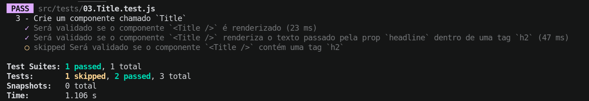
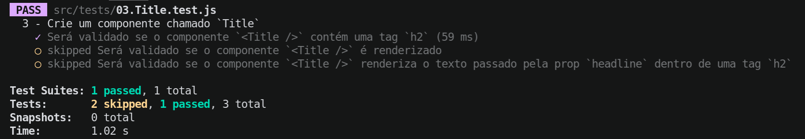
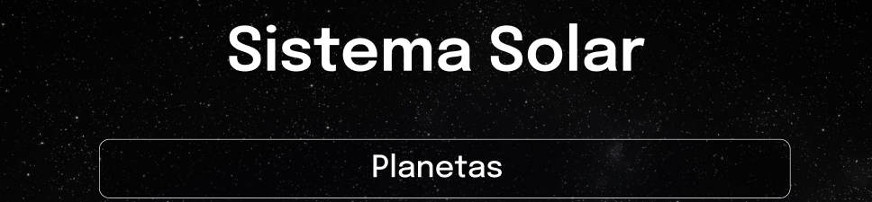
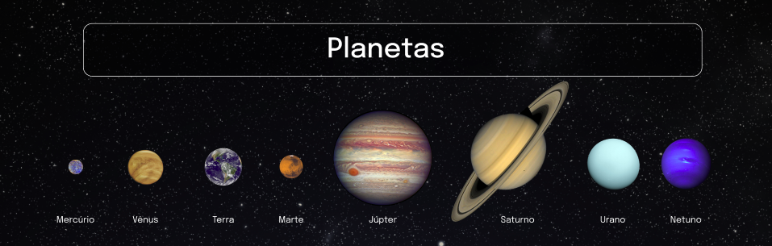
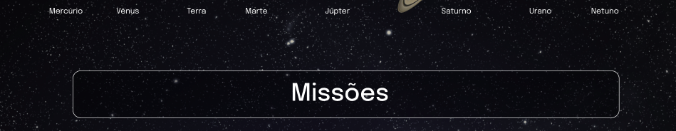
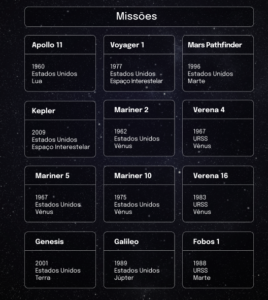

### Termos e acordos

Ao iniciar este projeto, você concorda com as diretrizes do Código de Ética e Conduta e do Manual da Pessoa Estudante da Trybe.

---

# Boas vindas ao repositório do projeto Sistema Solar!

Você já usa o GitHub diariamente para desenvolver os exercícios, certo? Agora, para desenvolver os projetos, você deverá seguir as instruções a seguir. Fique atento a cada passo, e se tiver qualquer dúvida, nos envie por _Slack_! #vqv 🚀

Aqui você vai encontrar os detalhes de como estruturar o desenvolvimento do seu projeto a partir deste repositório, utilizando uma branch específica e um _Pull Request_ para colocar seus códigos.

---


# Sumário

- [Boas vindas ao repositório do projeto Sistema Solar!](#boas-vindas-ao-repositório-do-projeto-sistema-solar)
- [Sumário](#sumário)
- [Habilidades](#habilidades)
- [Entregáveis](#entregáveis)
  - [O que deverá ser desenvolvido](#o-que-deverá-ser-desenvolvido)
  - [Desenvolvimento](#desenvolvimento)
  - [Data de Entrega](#data-de-entrega)
- [Observações técnicas](#observações-técnicas)
  - [Renderização Condicional](#renderização-condicional)
- [Instruções para entregar seu projeto](#instruções-para-entregar-seu-projeto)
  - [Antes de começar a desenvolver](#antes-de-começar-a-desenvolver)
  - [Durante o desenvolvimento](#durante-o-desenvolvimento)
  - [Depois de terminar o desenvolvimento (opcional)](#depois-de-terminar-o-desenvolvimento-opcional)
- [Como desenvolver](#como-desenvolver)
  - [ESLint-e-Stylelint](#eslint-e-stylelint)
  - [Execução de testes unitários](#execução-de-testes-unitários)
- [Requisitos do projeto](#requisitos-do-projeto)
  - [1. Crie um componente chamado `Header`](#1-crie-um-componente-chamado-header)
  - [2. Crie um componente chamado `SolarSystem`](#2-crie-um-componente-chamado-solarsystem)
  - [3. Crie um componente chamado `Title`](#3-crie-um-componente-chamado-title)
  - [4. Renderize o componente `Title` dentro do componente `SolarSystem`](#4-renderize-o-componente-Title-dentro-do-componente-SolarSystem)
  - [5. Crie um componente chamado `PlanetCard`](#5-crie-um-componente-chamado-planetcard)
  - [6. Renderize uma lista com os planetas do Sistema Solar](#6-renderize-uma-lista-com-os-planetas-do-sistema-solar)
  - [7. Crie um componente chamado `Missions`.](#7-crie-um-componente-chamado-missions)
  - [8. Renderize o componente `Title` dentro do componente `Missions`](#8-renderize-o-componente-Title-dentro-do-componente-Missions)
  - [9. Crie um componente chamado `MissionCard`](#9-crie-um-componente-chamado-MissionCard)
  - [10. Renderize uma lista com as missões espaciais](#10-renderize-uma-lista-com-as-missões-espaciais)
- [Avisos Finais](#avisos-finais)

---

# Habilidades
Neste projeto, verificamos se voce é capaz de:

  * Utilizar JSX no React

  * Utilizar corretamente o método `render()` para renderizar seus componentes

  * Utilizar `import` para trazer componentes em diferentes arquivos

  * Criar componentes de classe em React

  * Criar múltiplos componentes a partir de um array

  * Fazer uso de `props` corretamente

  * Fazer uso de `PropTypes` para validar as `props de um componente`

---

# Entregáveis

## O que deverá ser desenvolvido

Neste projeto você vai desenvolver um modelo do sistema solar! Ao utilizar essa aplicação uma pessoa usuária deverá ser capaz de:

  * Visualizar todos os planetas do sistema solar renderizados na tela;

  * Visualizar todas as cartas com informações sobre missões espaciais;

Ao final deste projeto, sua aplicação deverá ser algo semelhante a essa [imagem](https://www.figma.com/file/vcire16CytAa1QWrriuunm/Sistema-Solar?node-id=0%3A1).

Caso queira utilizar a mesma imagem de fundo apresentada no figma, ela está sendo disponibilizada dentro da pasta `src/images`.

Para entregar o seu projeto você deverá criar um Pull Request neste repositório.

Lembre-se que você pode consultar nosso conteúdo sobre Git & GitHub no Course sempre que precisar

## Desenvolvimento

Você deve desenvolver uma aplicação em React com criação de componentes de classe e passagem de props. Essa aplicação simulará uma visualização do **Sistema Solar**, bem como informações sobre diversas missões espacias que ocorreram ao longo da história.

As imagens dos planetas e as informações das missões são fornecidas no projeto. Você terá que desenvolver os componentes necessários para exibi-las na tela, conforme o descrito nos requisitos.

## Data de Entrega

  - Projeto individual.

  - Serão 2 dias de projeto.
  
  - Data de entrega para avaliação final do projeto: `11/01/2022 - 14:00h`.
---

# Observações técnicas

Você já aprendeu a criar componentes React, e nesse projeto vamos praticar muito essa habilidade. Crie todos os seus componentes em arquivos separados, na pasta **src/components**, no formato *_NomeDoComponente.js_*. Isso é fundamental para que os testes funcionem corretamente.

# Instruções para entregar seu projeto

## Antes de começar a desenvolver

1. Clone o repositório
  * `git clone git@github.com:tryber/sd-017-project-solar-system.git`.
  * Entre na pasta do repositório que você acabou de clonar:
    * `cd sd-017-project-solar-system`

2. Instale as dependências e inicialize o projeto
  * Instale as dependências:
    * `npm install`
  * Inicialize o projeto:
    * `npm start` (uma nova página deve abrir no seu navegador com um texto simples)
  * Verifique que os testes estão executando:
    * `npm test` (os testes devem rodar e falhar)

3. Crie uma branch a partir da branch `master`

  * Verifique que você está na branch `master`
    * Exemplo: `git branch`
  * Se não estiver, mude para a branch `master`
    * Exemplo: `git checkout master`
  * Agora, crie uma branch onde você vai guardar os commits do seu projeto
---

## Durante o desenvolvimento

* Faça `commits` das alterações que você fizer no código regularmente

* Lembre-se de sempre após um (ou alguns) `commits` atualizar o repositório remoto

* Os comandos que você utilizará com mais frequência são:
  1. `git status` _(para verificar o que está em vermelho - fora do stage - e o que está em verde - no stage)_
  2. `git add` _(para adicionar arquivos ao stage do Git)_
  3. `git commit` _(para criar um commit com os arquivos que estão no stage do Git)_
  4. `git push -u nome-da-branch` _(para enviar o commit para o repositório remoto na primeira vez que fizer o `push` de uma nova branch)_
  5. `git push` _(para enviar o commit para o repositório remoto após o passo anterior)_

---

## Depois de terminar o desenvolvimento (opcional)

Para **"entregar"** seu projeto, siga os passos a seguir:

* Vá até a página **DO SEU** _Pull Request_, adicione a label de _"code-review"_ e marque seus colegas
  * No menu à direita, clique no _link_ **"Labels"** e escolha a _label_ **code-review**
  * No menu à direita, clique no _link_ **"Assignees"** e escolha **o seu usuário**
  * No menu à direita, clique no _link_ **"Reviewers"** e digite `students`, selecione o time `tryber/students-sd-00`

---

# Como desenvolver

## ESLint e Stylelint

Para garantir a qualidade do código, vamos utilizar neste projeto os linters `ESLint` e `Stylelint`.
Assim o código estará alinhado com as boas práticas de desenvolvimento, sendo mais legível e de fácil manutenção! Para rodá-los localmente no projeto, execute os comandos abaixo:

```bash
npm run lint
npm run lint:styles
```

Em caso de dúvidas, confira o material do course sobre [ESLint e Stylelint](https://app.betrybe.com/course/real-life-engineer/eslint).

⚠️ Lembre-se que o seu projeto só será avaliado se estiver passando pelos **checks** dos **linters**.

---

## Execução de testes unitários

Vamos utilizar [React Testing Library](https://testing-library.com/docs/react-testing-library/intro) para execução dos testes unitários.

Esse _framework_ de testes utiliza algumas marcações no código para verificar a solução proposta, uma dessas marcações é o atributo `data-testid` e faremos uso dele aqui.

Na descrição dos requisitos do projeto será pedido que seja feita a adição de atributos `data-testid` nos elementos _HTML_. Veja o exemplo abaixo para deixar mais nítido como usar esse requisito:

Se o requisito pedir "crie um botão e adicione o id de teste (ou `data-testid`) com o valor `my-action`, você pode criar:

```html
<button data-testid="my-action"></button>
```

ou

```html
<a data-testid="my-action"></a>
```

Ou seja, o atributo `data-testid="my-action"` servirá para o React Testing Library(RTL) identificar o elemento e, dessa forma, conseguiremos realizar testes unitários focados no comportamento da aplicação.

Em alguns requisitos, utilizamos o `getByRole` para poder selecionar os elementos de forma semântica. Portanto atente-se às instruções de cada requisito. Por exemplo, se o requisito pedir explicitamente um `button`, você deverá utilizar exatamente esse elemento.

Para verificar a solução proposta, você pode executar todos os testes unitários localmente, basta executar:

```bash
npm test
```

### Dica: desativando testes

Especialmente no início, quando a maioria dos testes está falhando, a saída após executar os testes é extensa. Você pode desabilitar temporariamente um teste utilizando a função `.skip` junto à função `it`. Como o nome indica, esta função "pula" um teste:

```javascript
it.skip('Será validado se o componente `<Title />` contém uma tag `h2`', () => {
  render(<Title headline={headlineText} />);
  const headline = screen.getByRole('heading', { level: 2 });
    
  expect(headline).toBeInTheDocument();
});
```



Uma outra forma para contornar esse problema é a utilização da função `.only` após o `it`. Com isso, será possível que apenas um requisito rode localmente e seja avaliado.

```javascript
it.only('Será validado se o componente `<Title />` contém uma tag `h2`', () => {
  render(<Title headline={headlineText} />);
  const headline = screen.getByRole('heading', { level: 2 });
    
  expect(headline).toBeInTheDocument();
});
```




Você também pode rodar apenas um arquivo de teste, por exemplo:

```bash
npm test 03.Title.test.js
```

ou

```bash
npm test 03.Title
```
---

# Requisitos do projeto
:warning: **PULL REQUESTS COM ISSUES DE LINTER NÃO SERÃO AVALIADAS.** :warning:

:warning: **As imagens são meramente ilustrativas para visualizar o fluxo da aplicação, os nomes devem seguir os requisitos e não as imagens.** :warning:

## 1. Crie um componente chamado `Header`

- Crie um componente chamado `Header` dentro da pasta `src/components`. Este componente irá renderizar o título principal da página.
- Ele deve conter uma tag `header` e, dentro dela, uma tag `h1`. O texto da tag `h1` deve ser "Sistema Solar".
- Renderize o componente `Header` dentro do componente principal `App`.


### O que será verificado

* Será validado se o componente `<Header />` é renderizado.

* Será validado se o componente `<Header />` contém uma tag `header`.

* Será validado se o componente `<Header />` contém uma tag `h1`.

* Será validado se o componente `<Header />` renderiza corretamente o texto "Sistema Solar".

* Será validado se o componente `<Header />` está sendo renderizado no componente principal `App`.

## 2. Crie um componente chamado `SolarSystem`

- Crie um componente chamado `SolarSystem` dentro da pasta `src/components`.
- Este componente deve ter uma `div` que envolva todo seu conteúdo e que tenha o atributo `data-testid="solar-system"`.
- Renderize o componente `SolarSystem` abaixo do `Header`, dentro do componente principal `App`.

### O que será verificado

* Será validado se o componente `<SolarSystem />` é renderizado.

* Será validado se existe uma `div` que possui o `data-testid="solar-system"`.

* Será validado se o componente `<SolarSystem />` está sendo renderizado no componente principal `App`.

## 3. Crie um componente chamado `Title`

- Crie um componente chamado `Title` dentro da pasta `src/components`.
- O componente `Title` deve receber uma prop `headline`.
- Ele deve conter uma tag `h2`, que deve renderizar o texto recebido pela prop `headline`.

### O que será verificado

* Será validado se o componente `<Title />` é renderizado.

* Será validado se o componente `<Title />` contém uma tag `h2`.

* Será validado se o componente `<Title />` renderiza o texto passado pela prop `headline` dentro de uma tag `h2`.


## 4. Renderize o componente `Title` dentro do componente `SolarSystem`

- Renderize o componente `Title` dento do componente `SolarSystem`.
- O componente `Title` deve ser renderizado recebendo a prop `headline` com o valor "Planetas".



### O que será verificado

* Será validado se o texto "Planetas" é renderizado usando o componente `Title` dentro do componente `SolarSystem`.

## 5. Crie um componente chamado `PlanetCard`

- Crie um componente chamado `PlanetCard` dentro da pasta `src/components`.
- O componente `PlanetCard` deve receber duas props: uma chamada `planetName` e outra chamada `planetImage`.
- O componente `PlanetCard` deve ter uma `div` que envolva todo seu conteúdo e que tenha o atributo `data-testid="planet-card"`.
- O componente `PlanetCard` deve renderizar o texto recebido pela prop `planetName`. Você pode usar qualquer tag HTML que faça sentido, desde que ela tenha o atributo `data-testid="planet-name"`.
- O componente `PlanetCard` deve renderizar uma imagem que tenha o atributo `src` com o valor recebido pela prop `planetImage`.
- Além do atributo `src`, a imagem renderizada deve ter o atributo `alt` com o texto `Planeta {planetName}`, onde `{planetName}` é o valor recebido pela prop `planetName`.

### O que será verificado

* Será validado se o componente `<PlanetCard />` é renderizado.

* Será validado se o componente `<PlanetCard />` possui uma div com o atributo `data-testid="planet-card"`.

* Será validado se é renderizado o texto recebido pela prop `planetName`. 

* Será validado se é renderizada uma imagem com o atributo `src` com o mesmo valor recebido pela prop `planetImage`.

* Será validado se, além do atributo `src`, a imagem renderizada possui o atributo `alt` com o texto `Planeta {planetName}`, onde `{planetName}` é o valor recebido pela prop `planetName`.


## 6. Renderize uma lista com os planetas do Sistema Solar

- Renderize uma lista com os planetas do Sistema Solar dentro component `SolarSystem`.
- Utilize o componente `PlanetCard` para renderizar cada item da lista de planetas.
- Você encontrará a lista com os nomes e as imagens de cada planeta do Sistema Solar no arquivo `src/data/planets.js`.
- Você deve importar a lista no componente `SolarSystem` usando o código:
```javascript
import planets from '../data/planets';
```
- A lista de planetas é um _array_ de objetos no seguinte formato:
```javascript
{
  name: "Nome do planet",
  image: "caminho-para-imagem-do-planeta"
}
```
- Para cada planeta da lista, você deverá renderizar um componente `PlanetCard`, passando o atributo `name` para a prop `planetName` e o atributo `image` para a prop `planetImage`.

> :bulb: Dica: lembre-se do método que te permite criar vários componentes iguais a partir dos valores presentes em um array. Lembre-se que ao renderizar uma lista, você deve passar o atributo `key` para cada item. Você pode usar o nome do planeta como `key`.



### O que será verificado

* Será verificado se é renderizado um componente `<PlanetCard />` para cada planeta da lista de planetas.

* Será verificado se todos os planetas do Sistema Solar estão sendo listados na tela.


## 7. Crie um componente chamado `Missions`.

- Crie um componente chamado `Missions` dentro da pasta `src/components`.
- Este componente deve ter uma `div` que envolva todo seu conteúdo e que tenha o atributo `data-testid="missions"`.
- Renderize o componente `Missions` abaixo do `SolarSystem`, dentro do componente principal `App`.

### O que será verificado

* Será validado se o componente `<Missions />` é renderizado.

* Será validado se existe uma `div` que possui o `data-testid="missions"`.

* Será validado se o componente `<Missions />` está sendo renderizado no componente principal `App`.

## 8. Renderize o componente `Title` dentro do componente `Missions`.

- Renderize o componente `Title` dento do componente `Missions`.
- O componente `Title` deve ser renderizado recebendo a prop `headline` com o valor "Missões"



### O que será verificado

* Será validado se o texto "Missões" é renderizado usando o componente `Title` dentro do componente `Missions`.

## 9. Crie um componente chamado `MissionCard`.

- Crie um componente chamado `MissionCard` dentro da pasta `src/components`.
- O componente `MissionCard` deve receber quatro props:
  - `name`
  - `year`
  - `country`
  - `destination`

- O componente `MissionCard` deve ter uma `div` que envolva todo seu conteúdo e que tenha o atributo `data-testid="mission-card"`.
- O componente `MissionCard` deve renderizar o texto recebido pela prop `name`. Você pode usar qualquer tag HTML que faça sentido, desde que ela tenha o atributo `data-testid="mission-name"`.
- O componente `MissionCard` deve renderizar o texto recebido pela prop `year`. Você pode usar qualquer tag HTML que faça sentido, desde que ela tenha o atributo `data-testid="mission-year"`.
- O componente `MissionCard` deve renderizar o texto recebido pela prop `country`. Você pode usar qualquer tag HTML que faça sentido, desde que ela tenha o atributo `data-testid="mission-country"`.
- O componente `MissionCard` deve renderizar o texto recebido pela prop `destination`. Você pode usar qualquer tag HTML que faça sentido, desde que ela tenha o atributo `data-testid="mission-destination"`.

### O que será verificado

* Será validado se o componente `<MissionCard />` é renderizado.

* Será validado se o componente `<MissionCard />` possui uma div com o atributo `data-testid="mission-card"`.

* Será validado se é renderizado o texto recebido pela prop `name`.

* Será validado se é renderizado o texto recebido pela prop `year`.

* Será validado se é renderizado o texto recebido pela prop `country`.

* Será validado se é renderizado o texto recebido pela prop `destination`. 


## 10. Renderize uma lista com as missões espaciais

- Renderize uma lista com as missões espaciais dentro componente `Missions`.
- Utilize o componente `MissionCard` para renderizar cada item da lista de missões.
- Você encontrará a lista com as informações de cada missão espacial no arquivo `src/data/missions.js`.
- Você deve importar a lista no componente `Missions` usando o código:
```javascript
import missions from '../data/missions';
```
- A lista de missões espaciais é um _array_ de objetos no seguinte formato:
```javascript
{
  name: 'Nome da missão',
  year: 'Ano de lançamento da missão',
  country: 'País que lançou a missão',
  destination: 'Destino da missão',
}
```
- Para cada missão espacial da lista, você deverá renderizar um componente `MissionCard`, passando o cada atributo para sua respectiva prop.

> :bulb: Dica: lembre-se do método que te permite criar vários componentes iguais a partir dos valores presentes em um array. Lembre-se que ao renderizar uma lista, você deve passar o atributo `key` para cada item. Você pode usar o nome da missão como `key`.



### O que será verificado

* Será verificado se é renderizado um componente `<MissionCard />` para cada missão espacial da lista de missões.

* Será verificado se todas as missões espaciais estão sendo listados na tela.

# Avisos Finais

Ao finalizar e submeter o projeto, não se esqueça de avaliar sua experiência preenchendo o formulário. Leva menos de 3 minutos!

Link: [FORMULÁRIO DE AVALIAÇÃO DE PROJETO](https://bit.ly/2OfLJPn)

O avaliador automático não necessariamente avalia seu projeto na ordem em que os requisitos aparecem no readme. Isso acontece para deixar o processo de avaliação mais rápido. Então, não se assuste se isso acontecer, ok?

---
